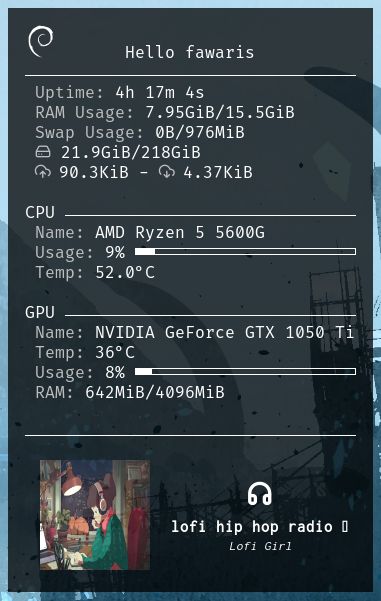

# Personal conky configuration

<div align="center"></div>

My conky configuration with an NVIDIA GPU and AMD Ryzen CPU. The configuration utilizes conky variables for GPU monitoring, and some nvidia-smi commands. 

This was tested on **Debian 12** with **X11** on **conky 1.18.3**.

## Requirements

For nvidia gpu compatibility install the `conky-all` package instead of the `conky` package.

```
sudo apt install conky-all
```

You will also need to install [playerctl](https://github.com/altdesktop/playerctl) for displaying music metadata.

```
sudo apt install playerctl
```

(Optional) If you have an AMD Ryzen CPU you may want to install [zenpower3](https://git.exozy.me/a/zenpower3) for displaying more information about your processor when using the `sensors` command . The k10temp kernel driver works good enough for the temperature.

## Install

1. Copy the `conky.conf` file, `/scripts` folder, and `/fonts` folder into `~/.config/conky/`. Conky will automatically look for a configuration `conky.conf` in this folder when you start it.

2. To install the fonts I have found that it's best to copy the .ttf files into `/usr/local/share/fonts` instead of `~/.local/share/fonts/` for better compatibility of some unicode characters.

```bash
sudo cp -r ~/.config/conky/fonts /usr/local/share/fonts
```

## Used fonts

You can find all the ttf files in the /fonts folder.

The main font is [Fira Code](https://github.com/tonsky/FiraCode) but you can change it to whatever you want.

For correctly displaying japanese kanji/hiragana for the music titles while maintaining the Fira Code font I use [RictyDiminished-with-FiraCode](https://github.com/hakatashi/RictyDiminished-with-FiraCode). Depending on your musical/font taste you may want to change it.

For the icons I use various fonts: [Material Icons](https://github.com/google/material-design-icons), ConkySymbols, [feather](https://github.com/feathericons/feather#feather), and [boxicons](https://boxicons.com/). 

I could not find the original ConkySymbols so I got the file from [this forum post](https://forums.linuxmint.com/viewtopic.php?p=1823165&sid=35b1f934ed5bc775491ef8c0aa4567b4#p1823165)

There are plans to reduce the amount of fonts in the future.

## Problems with fonts

I experienced many problems while trying to correctly display icons or special characters, like white rectangles or nothing at all. If you have the same problem try these steps:

- Restart conky `killall conky && conky`

- Restart your system (certified classic)

- Place your font files in a system wide folder like `/usr/local/share/fonts`

- Rebuild the font cache: `sudo fc-cache -fv`

- Force conky to run with UTF-8: `LC_ALL=en_US.utf8 conky` (this one worked for me)

If these steps did not work, make sure that the font that you are using actually has that character. You can use something like LibreOffice Writer, choose the font and paste the character to see what it displays.

## Find icons/characters in a font

You can use the `./font-list.sh /path/to/fontfile` script to print all of the characters that a font implements (I only tested .ttf and .otf files). This script is not mine and you can find it [here](https://unix.stackexchange.com/questions/595756/how-to-list-all-supported-glyphs-of-a-given-font).

Programs like [Gucharmap](https://wiki.gnome.org/Apps/Gucharmap) or [KCharSelect](https://apps.kde.org/kcharselect/) only confused me more by showing characters that the font doesn't actually have.

## Network

You will probably need to change the name of the network interface for the `upspeed` and `downspeed` variables on the network section of the `conky.conf` file for it to work properly. Use `ip a show` to find the name of your network interface.
